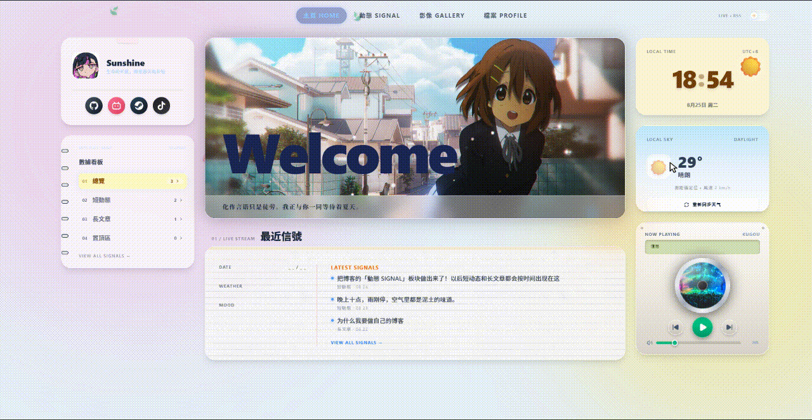
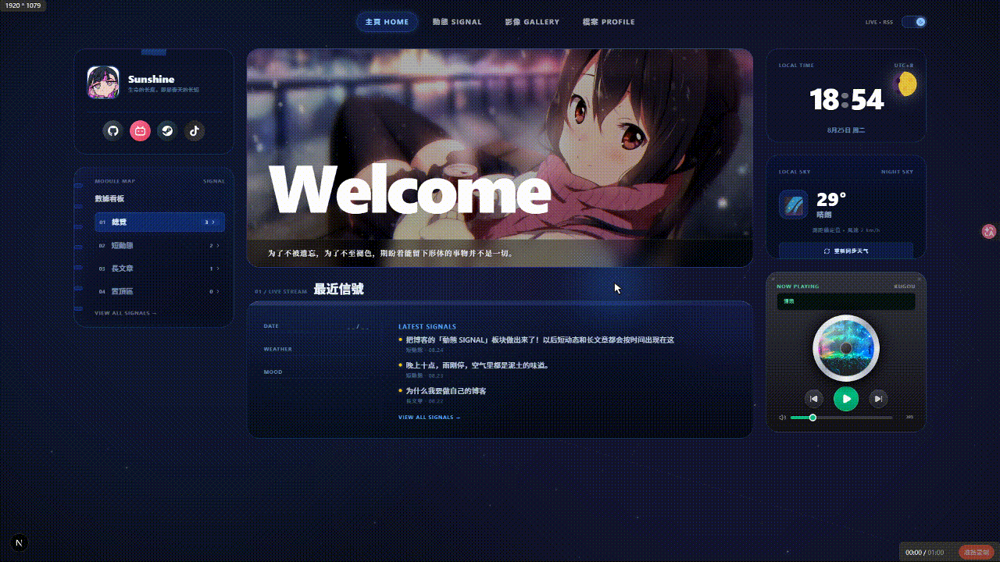

# 🌻 Sunshine's Space

一个氛围感个人空间 / 个人博客 —— 由 Next.js 打造的 Vibe 风格数字小屋。

## ✨ 功能特性

- **動態 SIGNAL** —— 短动态 + 长文章的时间线（`data/signals/*.md` 驱动），支持类型筛选、详情页、RSS 订阅
- **影像 GALLERY** —— 朋友圈式的本地影像墙：上传图片/视频（浏览器 IndexedDB 持久化）、配文、点赞、删除
- **檔案 PROFILE** —— 简历式毛玻璃档案卡：过场动画后缓缓落下，内含个人信息、教育、技能、兴趣、社交链接
- **🎵 CD 机音乐播放器** —— 复古 CD 机双模式皮肤（米白机身 / 黑色金属），旋转光盘、LCD 跑马灯、音量滑块
- **双主题** —— 浅色（向日葵氛围）/ dark（星空）一键切换，全站自定义发光光标
- **小组件** —— 本地时间（进度条）、天气（Open-Meteo）、个人简介、數據看板、最新信號

## 🛠 Tech Stack & Architecture (技术栈与架构)

本项目抛弃了传统的臃肿后端，采用 **Serverless + Git-based CMS** 的现代化架构，配合顶级动效库，实现 3A 级别的 Web 交互体验。

### ⚡ Core Framework (核心框架)
* **[Next.js (App Router)](https://nextjs.org/)**：全栈框架。全面启用 React Server Components (RSC)，将 Markdown 解析和数据过滤前置于服务端，实现首屏 0 闪烁极速直出。
* **[React](https://react.dev/) / TypeScript**：采用 Context API 构建了全局无缝音乐引擎 (`MusicProvider`) 和带 LocalStorage 记忆的主题引擎 (`ThemeProvider`)。

### 🎨 Styling & Motion (视觉与动效)
* **[Tailwind CSS v4](https://tailwindcss.com/)**：负责全站的 Bento Grid (便当盒) 绝对对齐排版、毛玻璃质感 (Glassmorphism) 与昼夜双轨主题。
  <br>
  

* **[Framer Motion](https://www.framer.com/motion/)**：驱动全站的灵魂。实现了 P3R(女神异闻录3) 风格的无缝路由拦截动画、水滴涟漪鼠标点击特效 (ClickShow)、以及具备真实物理回弹的卡片坠落效果。
  <br>
  
### 💾 Content Management (内容与数据层)
* **Git-based Markdown CMS**：以本地 `.md` 文件作为数据库，实现 100% 数据与视图解耦。
* **[gray-matter](https://github.com/jonschlinkert/gray-matter)**：解析文章 Frontmatter（如天气、心情、发布时间等元数据）。
* **remark & remark-html**：将长文章的 Markdown 语法安全地转换为干净的 HTML 注入网页。

### 🔌 APIs & Integrations (接口与拓展)
* **Open-Meteo API**：免 Key 的高精度气象接口，同步真实世界的温度与风速。
* **Next.js Route Handlers**：构建了纯正的后端 `/api/rss` 接口，提供原生的 RSS 订阅能力，致敬古典极客精神。

## 🌳 目录结构 (Directory Structure)

```text
my-vibe-blog/
├── app/                        # 页面路由 (App Router)
│   ├── page.tsx                # 主页（Bento Grid 仪表盘）
│   ├── layout.tsx              # 根布局（主题 / 音乐 / 光标 / 涟漪）
│   ├── signals/                # 動態 SIGNAL
│   │   ├── page.tsx            # 动态时间线
│   │   └── [slug]/page.tsx     # 长文章详情
│   ├── gallery/page.tsx        # 影像 GALLERY
│   ├── profile/page.tsx        # 档案 PROFILE
│   └── api/rss/route.ts        # RSS 订阅接口
├── components/                 # 组件
│   ├── MusicProvider.tsx       # 全局音乐引擎
│   ├── ThemeProvider.tsx       # 主题引擎（LocalStorage 记忆）
│   ├── CustomCursor.tsx        # 自定义发光光标
│   ├── ClickRipple.tsx         # 水滴涟漪点击特效
│   ├── MusicPlayer.tsx         # CD 机音乐播放器
│   ├── Gallery.tsx             # 朋友圈式影像墙
│   ├── SignalsTimeline.tsx     # 动态时间线
│   └── ...
├── config/site.ts              # 全站配置（个人信息 / 社交链接 / 歌单）
├── data/signals/*.md           # 动态内容（Git-based Markdown CMS）
├── lib/
│   ├── signals.ts              # 动态数据层（解析 Markdown）
│   └── galleryDB.ts            # 影像 IndexedDB 存储
├── public/                     # 静态资源（⚠️ 记得替换成你自己的音乐 / 视频 / 图片）
├── scripts/init-git.mjs        # 一键 Git 初始化上传脚本
└── package.json
```

## 🎵 关于静态资源

`public/` 目录下包含**作者个人的音乐（`music/*.mp3`）、视频（`loop.mp4` / `transition.mp4`）与图片**（动漫角色图、头像等）。**克隆本项目后请务必替换成你自己的资源**——个人项目，请自行确认素材版权，勿直接商用。

## 🚀 快速开始

> **环境要求**：Node.js **≥ 20.9**（推荐 22 LTS），npm 随 Node 附带。

```bash
npm install
npm run dev
```

打开 [http://localhost:3000](http://localhost:3000) 即可预览。

```bash
npm run build   # 生产构建
npm run start   # 启动生产服务器
```

## 📝 内容管理

### 发一条动态

在 `data/signals/` 下新建一个 `.md` 文件即可（dev 模式刷新即可见）：

```md
---
title: 可选，长文章建议填写
date: 2025-06-05 12:00
type: short          # short 短动态 | long 长文章
mood: 😊             # 可选
weather: 晴          # 可选
tags: [生活]         # 可选
summary: 列表页摘要   # 长文章建议填写
cover: /img/xx.jpg   # 长文章封面，可选
images: []           # 短动态配图，可选
---

正文（type 为 long 时支持完整 Markdown）
```

### 影像页

点击「添加影像」上传本地图片/视频，数据保存在**当前浏览器的 IndexedDB**（刷新不丢，但不同设备/浏览器之间不互通）。

## ⚙️ 配置

所有站点配置集中在 **`config/site.ts`**：

| 字段 | 说明 |
|---|---|
| `author` | 昵称、handle、头像、座右铭、频率 |
| `hero` | 主页大标题、副标题、描述 |
| `socials` | 简介卡社交徽章（GitHub / 哔哩哔哩 / Steam / 抖音，含品牌渐变底色） |
| `stats` | 数据看板（实际数字由 `lib/signals.ts` 自动统计，此处为后备值） |

其他可改项：

- **RSS 地址**：`app/api/rss/route.ts` 通过环境变量 `NEXT_PUBLIC_SITE_URL` 指定正式域名（默认 `http://localhost:3000`）
- **天气城市**：`components/WeatherWidget.tsx` 里的经纬度（默认东京）
- **歌单**：`components/MusicProvider.tsx` 的 `PLAYLIST` 数组

## ☁️ 部署

推荐使用 [Vercel](https://vercel.com/new)（Next.js 官方支持）：

1. 把仓库推到 GitHub
2. 在 Vercel 导入仓库，默认配置即可
3. 在环境变量中设置 `NEXT_PUBLIC_SITE_URL=https://你的域名`
4. 部署完成后把 `config/site.ts` 与天气经纬度改为线上值

> ⚠️ 注意：动态数据（`data/signals`）会随构建打包，新增内容需要重新部署；影像数据存在浏览器本地，不随服务器同步。

## 📄 License

MIT（个人项目，媒体资源版权归原作者所有）。
